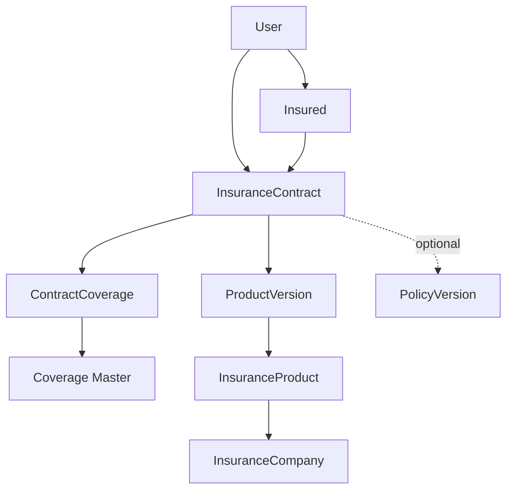

# Contract Domain

## 불변식

- `InsuranceProduct`와 사용자의 `InsuranceContract`는 별도 Entity입니다.
- `Coverage`와 실제 가입담보 `ContractCoverage`는 별도 Entity입니다.
- 계약은 `ProductVersion`을 필수 참조합니다.
- `PolicyVersion`은 nullable이며 이번 단계에서 자동 추정하지 않습니다.
- 가입금액은 정수 KRW로 저장하며 최종 보험금이 아닙니다.
- 가입 당시 담보명은 Snapshot으로 보존합니다.

## 권한과 개인정보

일반 사용자는 본인이 소유한 Insured, Contract, ContractCoverage에만 접근할 수 있습니다. Contract 하위 담보 작업도 항상 상위 Contract 소유권을 먼저 확인합니다. 이름, 생년월일, 증권번호는 Application Log에 기록하지 않습니다.

`identity_token`은 향후 토큰화된 외부 식별자를 위한 nullable 필드입니다. 현재 사용자 API는 주민등록번호나 임의 identity token 입력을 받지 않습니다.

## 변경 이력

계약 핵심정보와 가입금액 변경은 AuditLog에 before/after 값으로 기록됩니다. 물리 삭제 대신 계약 또는 담보 상태 변경을 사용합니다.

## 제외 범위

보험증권 OCR, Claim, Policy Version Resolver, Coverage Matcher, Rule 실행, 보험금 계산은 구현하지 않습니다.

