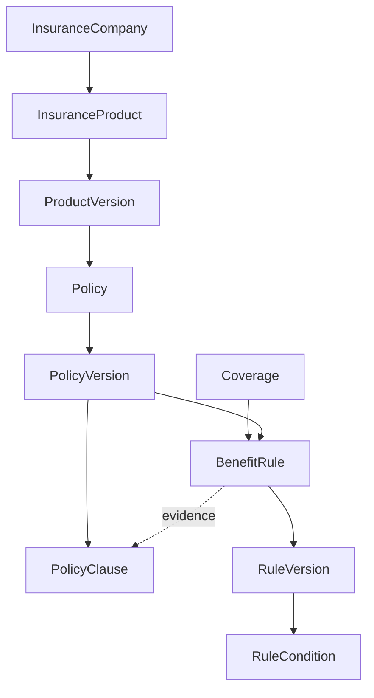

# Insurance Master

CODEX-02는 보험금 계산이 아니라 보험 지식의 버전 기반 저장 구조를 제공합니다.

## 경계

- `InsuranceProduct`는 보험사가 판매하는 상품 Master이며 사용자 계약이 아닙니다.
- `Coverage`는 표준 담보이며 사용자가 가입한 `ContractCoverage`가 아닙니다.
- `Policy`, `BenefitRule`은 논리 Master이고 실제 개정 내용은 각각 Version Entity로 보존합니다.
- Rule은 JSON 정의와 관계형 Condition을 저장하지만 실행하지 않습니다.
- Coverage에는 가입금액, 지급률, 면책·대기기간 또는 보험금을 저장하지 않습니다.

## 상태 안전장치

- 신규 PolicyVersion은 `DRAFT`로만 생성됩니다.
- `ACTIVE`·`DEPRECATED` PolicyVersion에는 조항을 추가할 수 없습니다.
- RuleVersion은 생성 요청만으로 `APPROVED` 또는 `ACTIVE`가 될 수 없습니다.
- AI 추출 RuleVersion은 `AI_EXTRACTED` 상태로 시작하며 자동 활성화되지 않습니다.
- Master와 Versioned Data에는 물리 삭제 API를 제공하지 않습니다.

## 관리자 권한

- 회사·상품·Policy: `POLICY_EDITOR`, `SYSTEM_ADMIN`
- Coverage: `POLICY_EDITOR`, `RULE_EDITOR`, `SYSTEM_ADMIN`
- Rule: `RULE_EDITOR`, `SYSTEM_ADMIN`

모든 권한 검사는 Backend에서 수행합니다.

## Test Data

자동 Production Seed는 없습니다. 테스트는 `TEST` 접두사가 있는 Fixture와 빈 Rule 정의만 사용하며 실제 보험 지급조건을 포함하지 않습니다.

