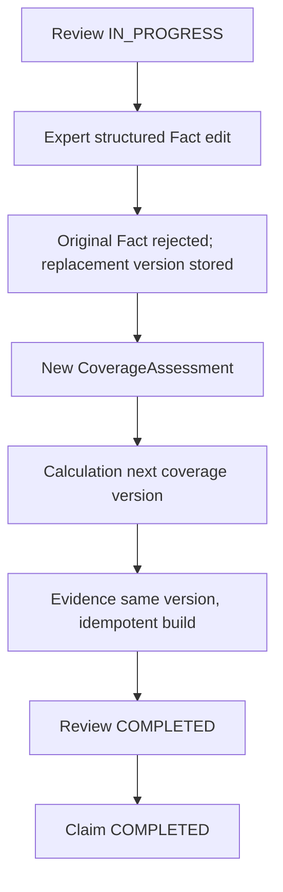
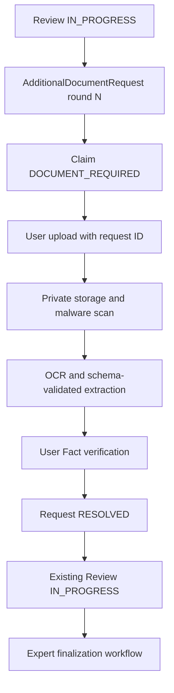

# Remaining Issues 종결 보고서

## Architecture 분석

Current architecture는 FastAPI application service가 versioned domain service를 조정하고 infrastructure port를 주입받는 modular monolith다. Gap은 Review 후속 orchestration, 추가자료와 요청의 식별 관계, Production adapter, 영속 세션 및 분산 제한이었다.

Implemented architecture:

```text
API → Review workflow → Fact/Assessment/Calculation/Evidence services
API/Worker → Ports → Local or Production adapters
Auth → signed cookie → persistent AuthSession validation
Security middleware → Redis distributed rate limiter (production)
```

## Workflow A — Expert Edit → Evidence V2+



동일 Review의 중복 modify는 상태 guard로 409가 되며 새 Calculation/Evidence를 만들지 않는다. Evidence version은 `Claim + ContractCoverage` 계산 이력과 같다.

## Workflow B — Additional Document → Review Resume



새 문서는 기존 Claim/Review/request에 연결되고 `submission_round`를 보존한다. 기존 OCR, Fact, Calculation 및 Evidence는 덮어쓰지 않는다.

## Adapter 구조

| Port | Development | Production | Configuration |
| --- | --- | --- | --- |
| ObjectStorage | LocalPrivateStorage | S3CompatibleObjectStorage | `OBJECT_STORAGE_PROVIDER=S3` |
| MalwareScanner | DevelopmentMalwareScanner | ClamAVMalwareScanner | `MALWARE_SCANNER_PROVIDER=CLAMAV` |
| OCRProvider | DevelopmentOCRProvider | HTTPOCRProvider | `OCR_PROVIDER=HTTP` |
| StructuredExtractionProvider | DevelopmentExtractionProvider | HTTPExtractionProvider | `AI_PROVIDER=HTTP` |
| RateLimiter | process-local development limiter | RedisRateLimiter | `DISTRIBUTED_RATE_LIMIT_ENABLED=true` |
| SessionStore | database AuthSession | database AuthSession | session cookie contains only signed IDs |

Production은 Local/Development/NoOp adapter를 허용하지 않는다. AI output은 `extra=forbid` schema를 통과해야 하며 benefit amount/decision 필드는 거부된다.

## Session과 Rate Limit

- Login마다 DB AuthSession 생성: session ID, user, 생성/최근사용/만료/폐기 시각, IP, user-agent.
- Logout은 현재 세션을 폐기하므로 탈취된 기존 JWT 재사용도 401이다.
- refresh, 특정 세션 폐기, 전체 기기 logout, 관리자 강제폐기 API를 제공한다.
- Production Redis rate limiter 장애 시 인증 endpoint는 fail-closed, 기타 제한 endpoint는 fail-open이다. 이 정책은 가용성과 인증 brute-force 방어의 차이를 명시적으로 반영한다.

## 운영 자산

- `scripts/bootstrap.ps1`: Compose build/up 및 readiness 확인.
- `scripts/backup_database.ps1`: PostgreSQL custom-format backup.
- `scripts/restore_database.ps1`: 별도 DB restore 및 Alembic version 확인.
- `tests/performance/api-smoke.js`: k6 health baseline. SLO가 승인되지 않아 임의 threshold는 설정하지 않았다.
- Playwright Chromium과 axe-core 접근성 자동검사.

## 테스트 결과

| Test | Status | Evidence |
| --- | --- | --- |
| Unit | IMPLEMENTED_AND_VERIFIED | engine, adapter contract, security |
| Integration | IMPLEMENTED_AND_VERIFIED | 전체 pytest suite |
| Expert Edit Workflow | IMPLEMENTED_AND_VERIFIED | Calculation/Evidence next version, duplicate guard |
| Additional Document Workflow | IMPLEMENTED_AND_VERIFIED | request link/round/upload/OCR/verification/resume |
| Adapter Contract | IMPLEMENTED_AND_VERIFIED | local storage, HTTP OCR/AI schema |
| Browser E2E | PARTIALLY_VERIFIED | Chromium UI/a11y; 전체 backend browser flow 미실행 |
| Accessibility | IMPLEMENTED_AND_VERIFIED | axe critical/serious + keyboard smoke |
| Concurrency | PARTIALLY_VERIFIED | DB optimistic Review revision/idempotency; multi-process 미실행 |
| Performance | IMPLEMENTED_NOT_RUNTIME_VERIFIED | k6 script 존재, k6/runtime baseline 미실행 |
| Backup/Restore | IMPLEMENTED_NOT_RUNTIME_VERIFIED | scripts 존재, Docker daemon 미실행 |

## Remaining Issue 재평가

```text
P0: 0
P1-01: RESOLVED
P1-02: RESOLVED
P1-03: RESOLVED (runtime credentials/provider verification pending)
```

## 최종 GAP Report

```text
P0: 0
P1: 0
P2:
- Full user/reviewer browser workflow fixture
- Multi-process PostgreSQL/Redis concurrency baseline
- Production provider certification and penetration test

Runtime Verification Pending:
- PostgreSQL/Redis fresh Docker bootstrap
- S3/ClamAV/OCR/AI staging connectivity
- backup → separate DB restore comparison
- k6 p50/p95/p99 baseline
- Redis restart and worker-kill recovery drill

Known Limitations:
- Browser automation currently covers UI accessibility, not every backend workflow action
- Redis rate limiter uses fixed windows

Production Readiness: CONDITIONALLY_READY
```

조건은 staging에서 위 Runtime Verification Pending 항목을 실행하고 실제 provider의 보안·계약 검증을 통과하는 것이다. 실행하지 않은 항목은 PASS로 간주하지 않는다.
